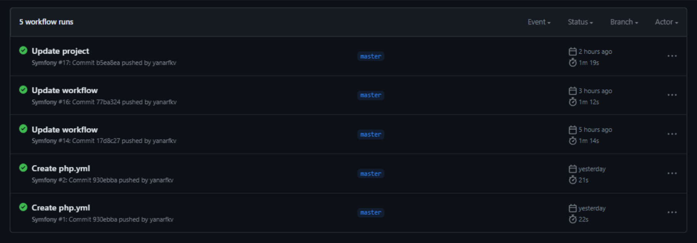
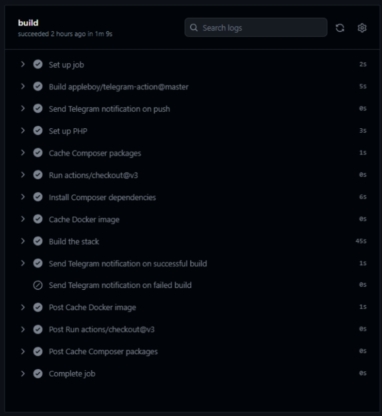
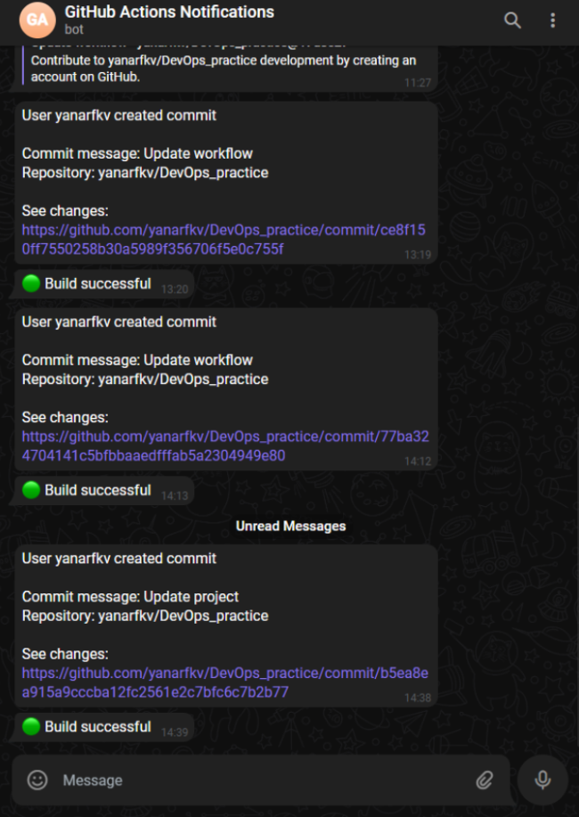

# DevOps - практиктическая работа

## Описание приложения

### Характеристики
Проект представляет собой веб-приложение на PHP (7.4) с использованием фреймворка Symfony (5.4) и СУБД PostgreSQL. Развёртывание приложения осуществляется с помощью Docker.

### Функционал
- Авторизация 
- Регистрация
- Добавление новых пользователей и вывод всех пользователей (http://localhost:8080/)

## Запуск приложения
```docker-compose up -d```

## Условия триггера
Используются два типа триггеров:
1. Push: Срабатывает при отправке (push) изменений в ветку master. Это означает, что действия, указанные в блоке jobs, будут выполнены при каждом новом коммите в ветку master.
2. Pull Request: Срабатывает при создании (pull_request) нового запроса на интеграцию изменений в ветку master. То есть, код в блоке jobs будет выполнен при каждом новом запросе на интеграцию изменений в ветку master.

## Принцип сборки
Процесс сборки проекта основан на последовательном выполнении шагов, описанных в блоке jobs.
1. **Отправка уведомления в Telegram:**
    - В блоке Send Telegram notification on push указано действие, которое отправляет уведомление в Telegram при каждом коммите в ветку master.
    - В блоке Send Telegram notification on successful build указано действие, которое отправляет уведомление в Telegram, когда сборка прошла успешно.
    - В блоке Send Telegram notification on failed build указано действие, которое отправляет уведомление в Telegram, когда сборка завершилась неудачно.
2. **Установка PHP:** В блоке Set up PHP используется действие shivammathur/setup-php@v2 для установки и настройки версии PHP 7.4.
3. **Кэширование Composer пакетов:** В блоке Cache Composer packages используется действие actions/cache@v3, чтобы сохранить и восстановить кэш пакетов Composer. Это позволяет избежать повторной загрузки пакетов при каждой сборке.
4. **Клонирование репозитория:** В блоке actions/checkout@v3 используется действие для клонирования репозитория.
5. **Установка зависимостей Composer:** В блоке Install Composer dependencies используется команда composer install для установки зависимостей проекта. Определенные флаги (--no-progress, --no-suggest, --prefer-dist, --optimize-autoloader) указывают на специфические настройки установки.
6. **Кэширование Docker образа:** В блоке Cache Docker image используется действие actions/cache@v3 для кэширования Docker образа. Это позволяет избежать повторной сборки образа при каждой сборке проекта.
7. **Сборка:** В блоке Build the stack используется команда docker-compose up -d --build для сборки проекта

## Результаты
GitHub Actions позволяет автоматизировать процесс разработки и сопровождения проектов. В данном случае, при каждом коммите в ветку master или создании нового запроса на интеграцию в ветку master, выполняются определенные шаги:

- Отправляется уведомление в Telegram о созданном коммите и о его содержимом.
- Устанавливается PHP версии 7.4.
- Кэшируются Composer пакеты для повторного использования.
- Клонируется репозиторий проекта.
- Устанавливаются зависимости Composer.
- Кэшируется Docker образ.
- Происходит сборка проекта с помощью Docker Compose.

Кроме того, после завершения сборки, в Telegram отправляется уведомление о результате сборки: успешной или неудачной.

При использовании GitHub Actions, можно обеспечить автоматическую сборку и уведомления о состоянии проекта на основе действий и событий, происходящих в репозитории на GitHub.



